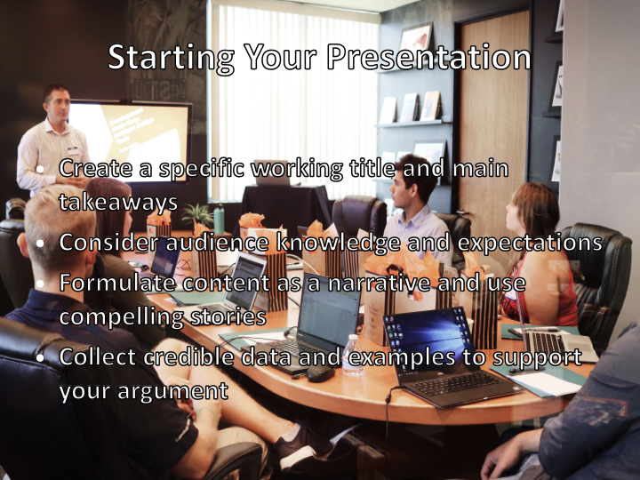

# YT2PP

pipeline to convert youtube videos to powerpoint presentations.

Steps:

1. Download youtube video
2. Convert to mp3
3. Transcribe audio
4. Use chatgpt to get presentation json
5. Create powerpoint from json

